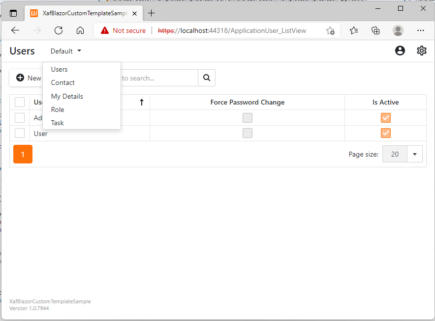

# XAF Blazor - How to create a custom template

This example demonstrates how to create and use a custom Application Window Template. In this template, we changed the built-in navigation system with a [DxMenu](https://docs.devexpress.com/Blazor/DevExpress.Blazor.DxMenu) component.

The following image demonstrates the result:



## Implementation Details

1. Create the "Templates" folder in your blazor \*.Blazor.Server application. It will contain the required templates.
2. Create a class named "CustomShowNavigationItemActionControl" that implements the *ISingleChoiceActionControl* interface. This is a custom action control that will be used to display a custom navigation component. To use it with the "ShowNavigationItem" action, specify its ActionId property accordingly.

***CustomShowNavigationItemActionControl.cs***

```cs
using DevExpress.ExpressApp.Actions;
using DevExpress.ExpressApp.Templates;
using DevExpress.ExpressApp.Templates.ActionControls;
using Microsoft.AspNetCore.Components;
using System;
using System.Collections.Generic;

namespace XafBlazorCustomTemplateSample.Blazor.Server.Templates {
    public class CustomShowNavigationItemActionControl : ISingleChoiceActionControl {
        private ChoiceActionItemCollection choiceActionItems;
        private EventHandler<SingleChoiceActionControlExecuteEventArgs> execute;
        string IActionControl.ActionId => "ShowNavigationItem";
        object IActionControl.NativeControl => this;
        public IEnumerable<ChoiceActionItem> Items => choiceActionItems;
        public RenderFragment GetComponentContent(RenderFragment titleTemplate) => CustomShowNavigationItemActionControlComponent.Create(titleTemplate, this);
        void ISingleChoiceActionControl.SetChoiceActionItems(ChoiceActionItemCollection choiceActionItems) => this.choiceActionItems = choiceActionItems;
        public void DoExecute(ChoiceActionItem choiceActionItem) {
            execute?.Invoke(this, choiceActionItem == null ? new SingleChoiceActionControlExecuteEventArgs() : new SingleChoiceActionControlExecuteEventArgs(choiceActionItem));
        }
        event EventHandler<SingleChoiceActionControlExecuteEventArgs> ISingleChoiceActionControl.Execute {
            add => execute += value;
            remove => execute -= value;
        }
        
        void IActionControl.SetCaption(string caption) { }
        void IActionControl.SetConfirmationMessage(string confirmationMessage) { }
        void IActionControl.SetEnabled(bool enabled) { }
        void IActionControl.SetImage(string imageName) { }
        void IActionControl.SetPaintStyle(ActionItemPaintStyle paintStyle) { }
        void ISingleChoiceActionControl.SetSelectedItem(ChoiceActionItem selectedItem) { }
        void IActionControl.SetShortcut(string shortcutString) { }
        void ISingleChoiceActionControl.SetShowItemsOnClick(bool value) { }
        void IActionControl.SetToolTip(string toolTip) { }
        void ISingleChoiceActionControl.Update(IDictionary<object, ChoiceActionItemChangesType> itemsChangedInfo) { }
        void IActionControl.SetVisible(bool visible) { }
        event EventHandler IActionControl.NativeControlDisposed { add { } remove { } }
    }
}
```

3. Create a custom Razor component that will render a DxMenu component.

***CustomShowNavigationItemActionControlComponent.razor***

```razor
@using DevExpress.ExpressApp.Actions

<DxMenu Data="@ActionControl.Items" ItemClick="@OnItemClick" HamburgerButtonPosition="MenuHamburgerButtonPosition.Left" CollapseItemsToHamburgerMenu="true">
    <TitleTemplate>
        @TitleTemplate
    </TitleTemplate>
    <DataMappings>
        <DxMenuDataMapping Text="@nameof(ChoiceActionItem.Caption)" Children="@nameof(ChoiceActionItem.Items)" />
    </DataMappings>
</DxMenu>

@code {
    public static RenderFragment Create(RenderFragment titleTemplate, CustomShowNavigationItemActionControl actionControl) =>
        @<CustomShowNavigationItemActionControlComponent TitleTemplate="@titleTemplate" ActionControl="@actionControl" />;
    [Parameter]
    public RenderFragment TitleTemplate { get; set; }
    [Parameter]
    public CustomShowNavigationItemActionControl ActionControl { get; set; }
    private void OnItemClick(MenuItemClickEventArgs e) => ActionControl.DoExecute((ChoiceActionItem)e.ItemInfo.Data);
}
```

4. Create a new Application Window Template using the [Template Gallery](https://docs.devexpress.com/eXpressAppFramework/113455/installation-upgrade-version-history/visual-studio-integration/template-gallery). Name it "CustomApplicationWindowTemplate".
5. In the created *CustomApplicationWindowTemplate* class, replace the built-in ShowNavigationItemActionControl with the created CustomShowNavigationItemActionControl:

```cs
using DevExpress.ExpressApp;
using DevExpress.ExpressApp.Blazor.Components.Models;
using DevExpress.ExpressApp.Blazor.Templates;
using DevExpress.ExpressApp.Blazor.Templates.Navigation.ActionControls;
using DevExpress.ExpressApp.Blazor.Templates.Security.ActionControls;
using DevExpress.ExpressApp.Blazor.Templates.Toolbar.ActionControls;
using DevExpress.ExpressApp.Templates;
using DevExpress.ExpressApp.Templates.ActionControls;
using DevExpress.Persistent.Base;
using Microsoft.AspNetCore.Components;
using System.Collections.Generic;

namespace XafBlazorCustomTemplateSample.Blazor.Server.Templates {
    public class CustomApplicationWindowTemplate : WindowTemplateBase, ISupportActionsToolbarVisibility, ISelectionDependencyToolbar {
        public CustomApplicationWindowTemplate() {
            NavigateBackActionControl = new NavigateBackActionControl();
            AddActionControl(NavigateBackActionControl);
            AccountComponent = new AccountComponentAdapter();
            AddActionControls(AccountComponent.ActionControls);
            ShowNavigationItemActionControl = new CustomShowNavigationItemActionControl();
            AddActionControl(ShowNavigationItemActionControl);

            IsActionsToolbarVisible = true;
            Toolbar = new DxToolbarAdapter(new DxToolbarModel());
            Toolbar.AddActionContainer(nameof(PredefinedCategory.ObjectsCreation));
            Toolbar.AddActionContainer(nameof(PredefinedCategory.Save));
            Toolbar.AddActionContainer("Close");
            Toolbar.AddActionContainer(nameof(PredefinedCategory.Export));
            Toolbar.AddActionContainer(nameof(PredefinedCategory.UndoRedo));
            Toolbar.AddActionContainer(nameof(PredefinedCategory.Edit));
            Toolbar.AddActionContainer(nameof(PredefinedCategory.RecordEdit));
            Toolbar.AddActionContainer(nameof(PredefinedCategory.RecordsNavigation));
            Toolbar.AddActionContainer(nameof(PredefinedCategory.View));
            Toolbar.AddActionContainer(nameof(PredefinedCategory.Reports));
            Toolbar.AddActionContainer(nameof(PredefinedCategory.Search));
            Toolbar.AddActionContainer(nameof(PredefinedCategory.Filters));
            Toolbar.AddActionContainer(nameof(PredefinedCategory.FullTextSearch));
            Toolbar.AddActionContainer(nameof(PredefinedCategory.Tools));
            Toolbar.AddActionContainer("Diagnostic");
            Toolbar.AddActionContainer(nameof(PredefinedCategory.Unspecified));
        }
        protected override IEnumerable<IActionControlContainer> GetActionControlContainers() => Toolbar.ActionContainers;
        protected override RenderFragment CreateComponent() => CustomApplicationWindowTemplateComponent.Create(this);
        protected override void BeginUpdate() {
            base.BeginUpdate();
            ((ISupportUpdate)Toolbar).BeginUpdate();
        }
        protected override void EndUpdate() {
            ((ISupportUpdate)Toolbar).EndUpdate();
            base.EndUpdate();
        }
        public bool IsActionsToolbarVisible { get; private set; }
        public NavigateBackActionControl NavigateBackActionControl { get; }
        public AccountComponentAdapter AccountComponent { get; }
        public CustomShowNavigationItemActionControl ShowNavigationItemActionControl { get; }
        public DxToolbarAdapter Toolbar { get; }
        public string AboutInfoString { get; set; }
        void ISupportActionsToolbarVisibility.SetVisible(bool isVisible) => IsActionsToolbarVisible = isVisible;
    }
}
```

6. Modify the CustomApplicationWindowTemplateComponent.razor component according to your business requirements.
7. In the BlazorApplication.cs files of your Blazor application, override the *CreateDefaultTemplate* method to use an instance of the created template:

```cs
...
namespace XafBlazorCustomTemplateSample.Blazor.Server {
    public partial class XafBlazorCustomTemplateSampleBlazorApplication : BlazorApplication {
        protected override IFrameTemplate CreateDefaultTemplate(TemplateContext context) {
            if (context == TemplateContext.ApplicationWindow) {
                return new CustomApplicationWindowTemplate() { AboutInfoString = AboutInfo.Instance.GetAboutInfoString(this) };
            }
            return base.CreateDefaultTemplate(context);
        }
...
```

<!-- default file list -->

## Files to Look At

- [CustomShowNavigationItemActionControl.cs](./XafBlazorCustomTemplateSample.Blazor.Server/Templates/CustomShowNavigationItemActionControl.cs)
- [CustomShowNavigationItemActionControlComponent.razor](./XafBlazorCustomTemplateSample.Blazor.Server/Templates/CustomShowNavigationItemActionControlComponent.razor)
- [CustomApplicationWindowTemplate.cs](./XafBlazorCustomTemplateSample.Blazor.Server/Templates/CustomApplicationWindowTemplate.cs)
- [CustomApplicationWindowTemplateComponent.razor](./XafBlazorCustomTemplateSample.Blazor.Server/Templates/CustomApplicationWindowTemplateComponent.razor)
- [BlazorApplication.cs](./XafBlazorCustomTemplateSample.Blazor.Server/BlazorApplication.cs)

<!-- default file list end --> 
