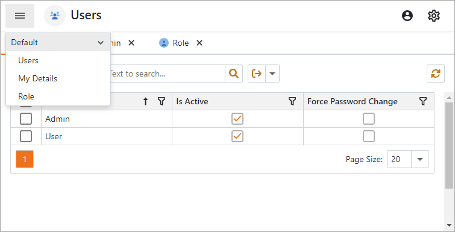

<!-- default badges list -->

<!-- default badges end -->

# XAF Blazor - How to create a custom template

This example demonstrates how to replace the built-in navigation system that uses a [DxAccordion](https://docs.devexpress.com/Blazor/DevExpress.Blazor.DxAccordion) or [DxTreeView](https://docs.devexpress.com/Blazor/DevExpress.Blazor.DxTreeView) component with a [DxMenu](https://docs.devexpress.com/Blazor/DevExpress.Blazor.DxMenu) component.

Refer to the following help topic for instructions on how to create a custom template with a [DxMenu](https://docs.devexpress.com/Blazor/DevExpress.Blazor.DxMenu) component: [How To: Create a Custom Blazor Application Template](https://docs.devexpress.com/eXpressAppFramework/403452/ui-construction/templates/in-blazor/custom-blazor-application-template).

## Files to Review

* [CustomTemplate.Blazor.Server/Templates](./CS/EFCore/CustomTemplate/CustomTemplate.Blazor.Server/Templates/)

## More Examples

* [XAF - How to: Create information panels](https://github.com/DevExpress-Examples/xaf-how-to-create-information-panels)
