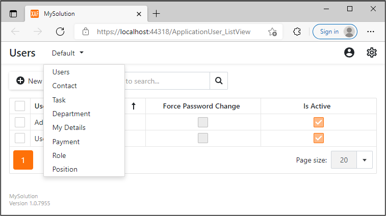

<!-- default badges list -->

<!-- default badges end -->
# XAF Blazor - How to create a custom template

This example demonstrates how to change the built-in navigation system (uses a [DxTreeView](https://docs.devexpress.com/Blazor/DevExpress.Blazor.DxTreeView?v=21.2) component) with a [DxMenu](https://docs.devexpress.com/Blazor/DevExpress.Blazor.DxMenu?v=21.2) component. 

Refer to the following article for details: [How To: Create a Custom Blazor Application Template](https://docs.devexpress.com/eXpressAppFramework/403452/ui-construction/templates/in-blazor/custom-blazor-application-template?v=21.2).

<!-- default file list -->

## Files to Look At

- [CustomShowNavigationItemActionControl.cs](./XafBlazorCustomTemplateSample.Blazor.Server/Templates/CustomShowNavigationItemActionControl.cs)
- [CustomShowNavigationItemActionControlComponent.razor](./XafBlazorCustomTemplateSample.Blazor.Server/Templates/CustomShowNavigationItemActionControlComponent.razor)
- [CustomApplicationWindowTemplate.cs](./XafBlazorCustomTemplateSample.Blazor.Server/Templates/CustomApplicationWindowTemplate.cs)
- [CustomApplicationWindowTemplateComponent.razor](./XafBlazorCustomTemplateSample.Blazor.Server/Templates/CustomApplicationWindowTemplateComponent.razor)
- [BlazorApplication.cs](./XafBlazorCustomTemplateSample.Blazor.Server/BlazorApplication.cs)

<!-- default file list end --> 
